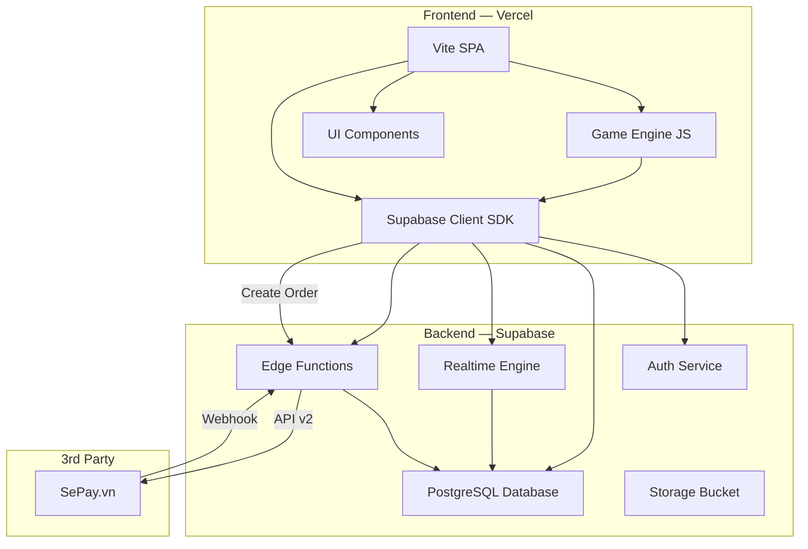
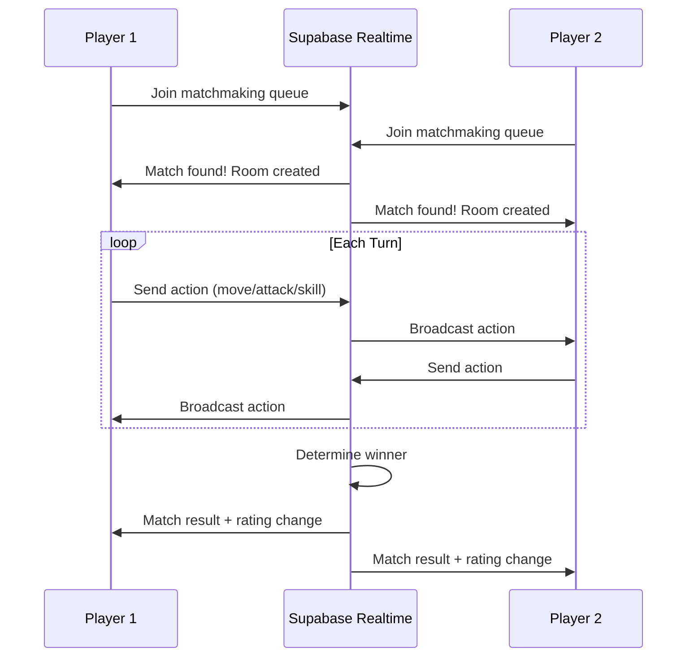
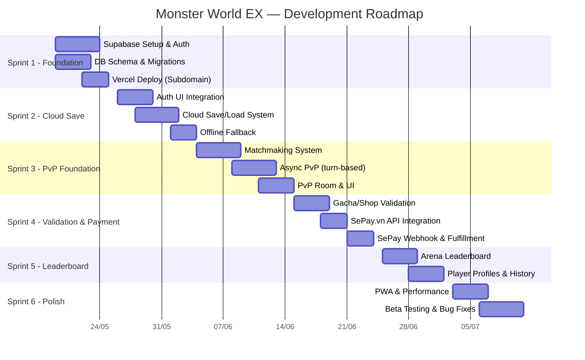

# 📋 PRD — Monster World EX WebApp

> **Version:** 1.1 · **Date:** 2026-05-18  
> **Stack:** Vercel (Frontend) + Supabase (Backend) + SePay.vn (Payment)  
> **Repo:** `monster-world-ex`

---

## 1. Tổng Quan Sản Phẩm

### 1.1 Mô Tả
Monster World EX là game chiến thuật theo lượt trên bảng grid, lấy cảm hứng từ Yu-Gi-Oh Monster World. Người chơi sưu tập, tiến hóa, và chỉ huy quái thú chiến đấu trên bản đồ chiến thuật.

### 1.2 Hiện Trạng (As-Is)
| Khía cạnh | Hiện tại |
|---|---|
| **Frontend** | Vanilla JS + Vite, single `index.html` |
| **Backend** | Không có (client-only) |
| **Lưu trữ** | `localStorage` + `IndexedDB` (local only) |
| **Auth** | Không có — chỉ nhập tên |
| **Multiplayer** | Không có — chỉ PvE vs AI |
| **Deploy** | Chưa rõ pipeline |

### 1.3 Mục Tiêu (To-Be)
| Khía cạnh | Mục tiêu |
|---|---|
| **Frontend** | Vite + Vercel Edge (SSR-ready) |
| **Backend** | Supabase (Auth, Database, Realtime, Storage) |
| **Lưu trữ** | Supabase PostgreSQL — cloud sync |
| **Auth** | Supabase Auth (Email, Google, Guest) |
| **Multiplayer** | PvP Realtime via Supabase Realtime |
| **Deploy** | Vercel CI/CD (Subdomain .vercel.app) |
| **Monetization** | Tích hợp SePay.vn (QR Code, Webhook) nạp Gems/Gold tự động |

### 1.4 Đối Tượng Người Dùng
- **Casual Gamers:** Chơi nhanh trên mobile/desktop
- **Collectors:** Sưu tập 100+ quái thú, hoàn thành Pokédex
- **Competitive Players:** PvP Arena, xếp hạng

---

## 2. Kiến Trúc Hệ Thống

### 2.1 High-Level Architecture



### 2.2 Phân Chia Trách Nhiệm

| Layer | Công nghệ | Vai trò |
|---|---|---|
| **Hosting & CDN** | Vercel | Static hosting trên `.vercel.app`, CI/CD |
| **Authentication** | Supabase Auth | Đăng ký/đăng nhập, JWT tokens |
| **Database** | Supabase PostgreSQL | Player data, monster data, rankings |
| **Realtime** | Supabase Realtime | PvP matchmaking, live battle sync |
| **Serverless Logic** | Supabase Edge Functions | Gacha, anti-cheat, SePay webhook handler |
| **Payment Gateway** | SePay.vn | Xử lý thanh toán tự động qua mã QR Ngân hàng |

---

## 3. Database Schema

### 3.1 Core Tables

```sql
-- ══════════════════════════════════════
-- PLAYERS
-- ══════════════════════════════════════
CREATE TABLE players (
  id UUID PRIMARY KEY REFERENCES auth.users(id),
  name VARCHAR(18) NOT NULL DEFAULT 'Yugi',
  gold INTEGER DEFAULT 500,
  gems INTEGER DEFAULT 10,
  total_score INTEGER DEFAULT 0,
  wins INTEGER DEFAULT 0,
  losses INTEGER DEFAULT 0,
  battles INTEGER DEFAULT 0,
  campaign_floor INTEGER DEFAULT 1,
  endless_floor INTEGER DEFAULT 0,
  arena_rating INTEGER DEFAULT 1000,
  talents JSONB DEFAULT '{}',
  traits JSONB DEFAULT '{}',
  created_at TIMESTAMPTZ DEFAULT NOW(),
  updated_at TIMESTAMPTZ DEFAULT NOW()
);

-- ══════════════════════════════════════
-- PLAYER_INVENTORY
-- ══════════════════════════════════════
CREATE TABLE player_inventory (
  player_id UUID REFERENCES players(id) ON DELETE CASCADE,
  item_id VARCHAR(30) NOT NULL,
  quantity INTEGER DEFAULT 0,
  PRIMARY KEY (player_id, item_id)
);

-- ══════════════════════════════════════
-- PLAYER_MONSTERS (Collection + Roster)
-- ══════════════════════════════════════
CREATE TABLE player_monsters (
  id SERIAL PRIMARY KEY,
  player_id UUID REFERENCES players(id) ON DELETE CASCADE,
  monster_id VARCHAR(30) NOT NULL,
  level INTEGER DEFAULT 1,
  xp INTEGER DEFAULT 0,
  is_in_roster BOOLEAN DEFAULT false,
  roster_slot INTEGER, -- 1-5
  evolved BOOLEAN DEFAULT false,
  evo_path_id VARCHAR(30),
  cls VARCHAR(10),
  affinity INTEGER DEFAULT 0,
  fatigue INTEGER DEFAULT 0,
  runes JSONB DEFAULT '[null, null, null]',
  acquired_at TIMESTAMPTZ DEFAULT NOW(),
  UNIQUE(player_id, monster_id)
);

-- ══════════════════════════════════════
-- ARENA LEADERBOARD (Materialized View)
-- ══════════════════════════════════════
CREATE MATERIALIZED VIEW arena_leaderboard AS
SELECT 
  p.id, p.name, p.arena_rating, p.wins, p.losses,
  RANK() OVER (ORDER BY p.arena_rating DESC) as rank
FROM players p
WHERE p.arena_rating > 0
ORDER BY p.arena_rating DESC
LIMIT 100;

-- ══════════════════════════════════════
-- PVP MATCHES (Battle History)
-- ══════════════════════════════════════
CREATE TABLE pvp_matches (
  id UUID PRIMARY KEY DEFAULT gen_random_uuid(),
  player1_id UUID REFERENCES players(id),
  player2_id UUID REFERENCES players(id),
  winner_id UUID REFERENCES players(id),
  mode VARCHAR(10) DEFAULT 'arena',
  rating_change INTEGER,
  match_data JSONB, -- replay data
  played_at TIMESTAMPTZ DEFAULT NOW()
);

-- ══════════════════════════════════════
-- ORDERS (SePay.vn Integration)
-- ══════════════════════════════════════
CREATE TABLE orders (
  id UUID PRIMARY KEY DEFAULT gen_random_uuid(),
  player_id UUID REFERENCES players(id),
  order_code VARCHAR(50) UNIQUE NOT NULL,
  amount INTEGER NOT NULL,
  package_id VARCHAR(30) NOT NULL,
  status VARCHAR(20) DEFAULT 'pending', -- pending, success, failed
  qr_code_url TEXT,
  created_at TIMESTAMPTZ DEFAULT NOW(),
  updated_at TIMESTAMPTZ DEFAULT NOW()
);
```

### 3.2 Row Level Security (RLS)

```sql
-- Players can only read/write their own data
ALTER TABLE players ENABLE ROW LEVEL SECURITY;

CREATE POLICY "Players read own data" ON players
  FOR SELECT USING (auth.uid() = id);

CREATE POLICY "Players update own data" ON players
  FOR UPDATE USING (auth.uid() = id);

-- Leaderboard is public read
CREATE POLICY "Leaderboard public read" ON arena_leaderboard
  FOR SELECT USING (true);
  
-- Orders reading
CREATE POLICY "Players read own orders" ON orders
  FOR SELECT USING (auth.uid() = player_id);
```

---

## 4. Tính Năng Chi Tiết

### 4.1 Authentication (Supabase Auth)

| Tính năng | Mô tả | Priority |
|---|---|---|
| Guest Login | Chơi ngay không cần đăng ký, data lưu local + có thể link sau | P0 |
| Email/Password | Đăng ký bằng email | P1 |
| Google OAuth | Đăng nhập nhanh bằng Google | P1 |
| Guest → Full Account | Chuyển đổi guest sang full account, migrate data | P2 |

### 4.2 Cloud Save & Sync

| Tính năng | Mô tả | Priority |
|---|---|---|
| Auto-save | Tự động lưu lên Supabase sau mỗi trận/mua hàng | P0 |
| Offline Fallback | Vẫn dùng localStorage khi offline, sync khi online | P0 |
| Cross-device | Chơi trên PC, tiếp tục trên mobile | P1 |
| Conflict Resolution | Last-write-wins với timestamp comparison | P1 |

### 4.3 Core Game (Giữ nguyên từ client)

> [!NOTE]
> Toàn bộ game logic hiện tại (combat, movement, AI, map generation) **giữ nguyên chạy client-side**. Chỉ kết quả trận đấu được gửi lên server để validate.

| Module | Files hiện tại | Thay đổi |
|---|---|---|
| Combat Engine | `combat.js`, `movement.js` | Không đổi |
| Turn System | `TurnSystem.js` | Không đổi |
| Map Generator | `MapGenerator.js` | Không đổi |
| Enemy Spawner | `EnemySpawner.js` | Không đổi |
| Session Manager | `SessionManager.js` | Thêm cloud save hooks |
| UI / Renderer | `Renderer.js`, `Tabs.js` | Thêm auth UI |

### 4.4 Gacha System (Server-side Validation)

> [!IMPORTANT]
> Gacha rolls **phải chạy server-side** (Edge Function) để chống hack.

```
POST /api/gacha/roll
Body: { type: "common" | "premium" | "rune" }
Response: { success, monster/rune, gold_remaining }
```

**Logic:**
1. Verify player có đủ gold (DB check, không trust client)
2. Roll theo xác suất server-side
3. Trừ gold + thêm monster vào collection (atomic transaction)
4. Return kết quả

### 4.5 PvP Arena (Realtime)



| Tính năng | Priority |
|---|---|
| Matchmaking Queue | P1 |
| Turn-based PvP (async) | P1 |
| Realtime PvP | P2 |
| Spectator Mode | P4 |

### 4.6 Leaderboard & Social

| Tính năng | Priority |
|---|---|
| Arena Ranking (Top 100) | P1 |
| Player Profile (public) | P2 |
| Friends List | P3 |
| Chat (lobby) | P4 |

### 4.7 Monetization & Payment (SePay.vn)

| Tính năng | Priority |
|---|---|
| UI Nạp tiền | P1 |
| Gọi SePay API v2 tạo mã QR | P1 |
| Endpoint Webhook nhận IPN từ SePay (HMAC-SHA256) | P1 |
| Cộng Gems/Gold tự động khi thanh toán thành công | P1 |
| Lịch sử giao dịch | P2 |

---

## 5. API Design (Supabase Edge Functions)

### 5.1 Auth Endpoints
| Method | Endpoint | Mô tả |
|---|---|---|
| POST | `/auth/signup` | Đăng ký (Supabase built-in) |
| POST | `/auth/login` | Đăng nhập (Supabase built-in) |
| POST | `/auth/google` | OAuth Google (Supabase built-in) |

### 5.2 Game & Payment Endpoints (Edge Functions)
| Method | Endpoint | Mô tả |
|---|---|---|
| GET | `/api/player/profile` | Lấy player data |
| PUT | `/api/player/save` | Lưu game state |
| POST | `/api/gacha/roll` | Roll gacha (server-validated) |
| POST | `/api/shop/buy` | Mua item (server-validated) |
| POST | `/api/battle/result` | Submit kết quả trận |
| POST | `/api/fusion/execute` | Thực hiện fusion |
| GET | `/api/leaderboard` | Arena rankings |
| POST | `/api/arena/queue` | Join PvP queue |
| POST | `/api/payment/create-order` | Tạo order, gọi SePay lấy QR code |
| POST | `/api/payment/webhook` | Webhook nhận biến động số dư từ SePay |

### 5.3 Realtime Channels
| Channel | Mục đích |
|---|---|
| `pvp:{room_id}` | Sync actions giữa 2 players |
| `matchmaking` | Presence-based queue |
| `leaderboard` | Live rank updates |

---

## 6. Lộ Trình Phát Triển (6 Sprints)

> **Cập nhật:** Ưu tiên PvP sớm (Sprint 3), tích hợp thanh toán SePay.vn (Sprint 4), deploy lên Vercel Subdomain.



---

### Sprint 1: Foundation (5 ngày)

> **Mục tiêu:** Setup hạ tầng Supabase + Vercel (Subdomain), deploy được bản hiện tại.

| Task | Chi tiết | Effort |
|---|---|---|
| **1.1** Tạo Supabase Project | Tạo project, config region (Singapore) | 1h |
| **1.2** Database Schema | Chạy SQL migrations cho tất cả tables | 4h |
| **1.3** RLS Policies | Thiết lập Row Level Security | 2h |
| **1.4** Supabase Auth Config | Enable Email + Google OAuth | 2h |
| **1.5** Vercel Project Setup | Config `monsterworldex.vercel.app` (Subdomain) | 2h |
| **1.6** CI/CD Pipeline | Auto-deploy on push to `main` | 2h |

**Deliverable:** Game deploy thành công trên Vercel subdomain, Supabase project sẵn sàng.

---

### Sprint 2: Cloud Save & Auth (7 ngày)

> **Mục tiêu:** Người chơi đăng nhập và data sync lên cloud.

| Task | Chi tiết | Effort |
|---|---|---|
| **2.1** Auth UI Component | Login/Register modal thay `name-modal` | 6h |
| **2.2** Guest Mode | Chơi không cần đăng ký, data ở local | 3h |
| **2.3** `SupabasePlayerState.js` | Module mới — thay `playerState.js` cho cloud | 8h |
| **2.4** Save Triggers | Hook vào `savePlayer()`, batch writes | 4h |
| **2.5** Load & Sync | Sync data từ Supabase, offline fallback | 8h |

**Deliverable:** Đăng nhập → chơi → data tự lưu cloud → đổi thiết bị vẫn còn.

---

### Sprint 3: PvP Foundation (Ưu Tiên) (8 ngày)

> **Mục tiêu:** Phát triển PvP Arena sớm để test vòng lặp Gameplay Multiplayer.

| Task | Chi tiết | Effort |
|---|---|---|
| **3.1** Matchmaking Queue | Supabase Presence + rating-based matching | 8h |
| **3.2** PvP Room Management | Create/join rooms, timeout handling | 6h |
| **3.3** Turn Sync Protocol | Realtime broadcast moves/attacks giữa 2 players | 10h |
| **3.4** PvP Game Over | Rating calculation, rewards distribution | 4h |
| **3.5** PvP UI Adaptation | "Waiting for opponent", timer display | 5h |

**Deliverable:** 2 người chơi có thể match và đánh PvP turn-based qua Supabase Realtime.

---

### Sprint 4: Server Validation & Payment (SePay) (7 ngày)

> **Mục tiêu:** Chống gian lận và Tích hợp Nạp thẻ/Gems qua SePay.vn.

| Task | Chi tiết | Effort |
|---|---|---|
| **4.1** Gacha & Shop Validation | Edge Function cho Gacha roll và mua item | 6h |
| **4.2** Battle Validation | Validate score/rewards hợp lý (anti-cheat) | 4h |
| **4.3** Payment UI | Màn hình chọn gói nạp Gems (Ví dụ: 10,000đ = 100 Gems) | 3h |
| **4.4** SePay API Create Order | Gọi API v2 SePay tạo mã QR thanh toán động | 4h |
| **4.5** SePay Webhook Endpoint | Nhận IPN từ SePay, verify HMAC-SHA256, deduplicate | 5h |
| **4.6** Fulfillment | Cộng Gems tự động vào DB khi thanh toán thành công | 3h |

**Deliverable:** Chống cheat hiệu quả. Người chơi có thể nạp tiền tự động qua quét mã QR Ngân hàng.

---

### Sprint 5: Leaderboard & Social (5 ngày)

> **Mục tiêu:** Bảng xếp hạng từ kết quả PvP và tương tác xã hội.

| Task | Chi tiết | Effort |
|---|---|---|
| **5.1** Leaderboard API | Materialized view + refresh cron cho Arena Rank | 4h |
| **5.2** Leaderboard UI | Hiển thị Top 100 Arena | 5h |
| **5.3** Player Profile & History | Xem profile và lịch sử đấu PvP | 6h |
| **5.4** Achievements | Các mốc thưởng: "First Win", "Top 100" | 4h |

**Deliverable:** Hệ thống cạnh tranh xếp hạng rõ ràng.

---

### Sprint 6: Polish & Launch (6 ngày)

> **Mục tiêu:** Hoàn thiện trải nghiệm, tối ưu hiệu năng và Beta test.

| Task | Chi tiết | Effort |
|---|---|---|
| **6.1** PWA Manifest & SW | Cài đặt như App (Installable) | 4h |
| **6.2** Performance & Bug Fix | Audit Lighthouse, fix bugs từ Sprint PvP | 8h |
| **6.3** Analytics | Vercel/Supabase Analytics events | 3h |
| **6.4** Beta Test | Invite testers vòng cuối trước khi live | 6h |

**Deliverable:** Production-ready webapp, sẵn sàng cho public launch.

---

## 7. Tech Stack Summary

| Layer | Technology | Lý do chọn |
|---|---|---|
| **Build Tool** | Vite 5 | Đã dùng, fast HMR |
| **Frontend** | Vanilla JS (ES Modules) | Đã dùng, lightweight |
| **CSS** | Vanilla CSS | Đã dùng, 86KB `main.css` |
| **Hosting** | Vercel | Free tier tốt, Edge network, CI/CD, Subdomain free |
| **Auth** | Supabase Auth | OAuth + Email + Anonymous, free tier |
| **Database** | Supabase PostgreSQL | 500MB free, RLS, Realtime |
| **Realtime** | Supabase Realtime | WebSocket cho PvP |
| **Serverless** | Supabase Edge Functions | Deno-based, cùng ecosystem |
| **Payment** | SePay.vn API v2 | Tự động hóa nạp qua mã QR nội địa |

---

## 8. Rủi Ro & Mitigation

| Rủi ro | Mức độ | Giải pháp |
|---|---|---|
| Supabase free tier limit (500MB DB) | Medium | Monitor usage, archive old matches |
| Realtime connection limits | Medium | Queue-based matchmaking, connection pooling |
| Lỗi mạng khi thanh toán SePay | Low | Tra cứu đối soát (Reconciliation) API hằng ngày |
| Offline → Online sync conflicts | Medium | Timestamp-based resolution + user prompt |
| Vercel bandwidth limits | Low | Static assets CDN, lazy loading |

---

## 9. Metrics & KPIs

| Metric | Target | Tool |
|---|---|---|
| DAU (Daily Active Users) | 50+ sau beta | Supabase Analytics |
| Retention D1 / D7 | 40% / 20% | Custom events |
| Nạp thẻ (SePay Conversion) | > 5% users | Query DB `orders` |
| PvP Match Completion Rate | > 80% | DB query |
| Error Rate | < 1% | Sentry/Vercel Analytics |

---

## 10. Phụ Lục

### 10.1 File Structure Mới (Dự kiến)

```
monster-world-ex/
├── index.html
├── package.json
├── vite.config.js
├── vercel.json
├── .env.local                    # SUPABASE_URL, SEPAY_API_KEY...
├── src/
│   ├── main.js
│   ├── core/
│   │   ├── data.js               # (giữ nguyên)
│   │   ├── gameState.js          # (giữ nguyên)
│   │   ├── playerState.js        # (refactor → cloud-aware)
│   │   └── supabaseClient.js     # ★ NEW: Supabase init
│   ├── api/
│   │   ├── auth.js               # ★ NEW: Auth helpers
│   │   ├── cloudSave.js          # ★ NEW: Save/Load cloud
│   │   ├── gachaAPI.js           # ★ NEW: Server gacha calls
│   │   ├── leaderboardAPI.js     # ★ NEW: Ranking queries
│   │   └── paymentAPI.js         # ★ NEW: Create order SePay
│   ├── combat/                   # (giữ nguyên)
│   ├── features/                 # (giữ nguyên, refactor Shop.js)
│   ├── systems/                  # (giữ nguyên)
│   └── ui/
│       ├── AuthModal.js          # ★ NEW: Login/Register UI
│       ├── LeaderboardUI.js      # ★ NEW: Rankings display
│       └── ... (giữ nguyên)
├── styles/
│   └── main.css                  # (thêm auth styles)
└── supabase/
    ├── migrations/
    │   ├── 001_create_tables.sql
    │   └── 002_rls_policies.sql
    └── functions/
        ├── gacha-roll/
        ├── shop-buy/
        ├── battle-result/
        ├── sepay-create-order/   # Gọi SePay API v2 tạo QR
        └── sepay-webhook/        # Nhận biến động số dư
```

### 10.2 Supabase Client Init

```javascript
// src/core/supabaseClient.js
import { createClient } from '@supabase/supabase-js';

const supabaseUrl = import.meta.env.VITE_SUPABASE_URL;
const supabaseKey = import.meta.env.VITE_SUPABASE_ANON_KEY;

export const supabase = createClient(supabaseUrl, supabaseKey);
```

---

> [!TIP]
> **Khuyến nghị lộ trình:** Sprint 1 + 2 là critical path (Bắt buộc). Việc đẩy **PvP lên Sprint 3** sẽ giúp kiểm chứng multiplayer sớm. Tích hợp thanh toán **SePay nằm gọn ở Sprint 4** (Server-side) độc lập và an toàn nhờ webhook. Domain sử dụng Vercel subdomain (`tên-game.vercel.app`) để tiết kiệm chi phí ban đầu, sau này gắn custom domain dễ dàng qua Vercel.
